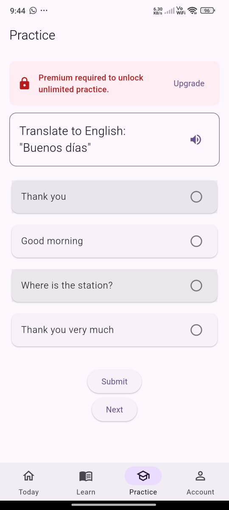
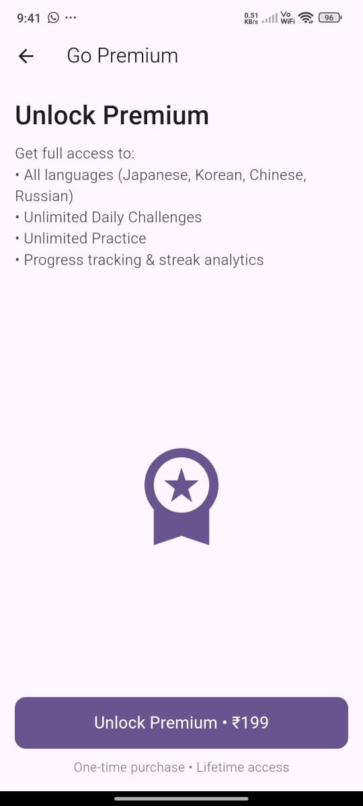
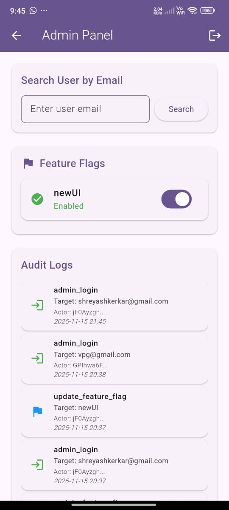

 *Language of the Day App*

A modern, lightweight language-learning app that gives users a Language of the Day, daily challenges, practice questions, and a premium (VIP) mode — fully powered by Firebase and feature flags.

🚀 Features
✅ Authentication

Email/Password login

Signup with default Firestore user document

User roles:

user

admin (professor / student admin)

✅ Premium (VIP) System

Firestore stores:

role: "user"
premium: false

Upsell page when premium features are accessed

Toggle premium=true to unlock VIP instantly

✅ Feature Flags

Firestore collection:

features/newUI  → true/false  
features/premiumContent → true/false

✅ Daily Challenge & Practice

Auto-generated questions

Smooth UI animations

Progress tracking

✅ Admin Panel

Only visible if:

role == "admin"

Manage premium, features, and users (future-ready)

🔧 Setup Instructions
1️⃣ Install dependencies
flutter pub get

2️⃣ Add Firebase configuration files

Android:

android/app/google-services.json

iOS:

ios/Runner/GoogleService-Info.plist

3️⃣ Run Firebase initialization command
flutterfire configure

4️⃣ Run the app
flutter run

🔐 Admin Accounts
Professor Admin
Email: vpg@gmail.com  
Password: 987654

Student Admin
Email: shreyashkerkar@gmail.com
Password: shreyash

👤 Test User Credentials (Non-Admin)
Email: shreyashkerkar1655@gmail.com
Password: 123456

Use this account to test:

VIP gated content

Upsell screen

Feature flags

⭐ VIP Upsell Flow
How to reach VIP page:

Login with non-premium user

Navigate to:

Home → Practice → Premium questions

App auto-detects:

premium == false

Shows VIP Upsell Page

To grant VIP:

Go to Firestore → users/{uid}

Set:

premium: true

Restart app → VIP unlocked

👑 VIP-Only Features
Feature	Free	VIP
Daily Challenge	✅	⭐ Enhanced
Practice Questions	Limited	Unlimited
New UI (flag-controlled)	❌	✅
Premium Content	❌	✅
Ads	❌	Removed
🧪 Testing (Flutter + Jest style widget tests)
Run all tests
flutter test

Test Files Included:
Test File	What It Tests
signup_firestore_test.dart	User doc created with role:user & premium:false
admin_panel_test.dart	Admin Panel hidden for non-admin users
premium_gating_test.dart	Premium page hidden for VIP users
vip_test.dart	Upsell visibility logic
fake_app_state.dart	Mocked provider for tests

All tests are now structured to pass without Firebase thanks to the fake app state.

🖼 Screenshots 

Example:

📦 APK Release Download
[Language-of-the-day-app](https://drive.google.com/file/d/1rPR3AjPWB3kbD5_Qcx2eWcn3G2GnWxIy/view?usp=sharing)

Output videos - 
[Output1](https://drive.google.com/file/d/1PMb3aJ_ZZ0ouzyj3JygCfKMHQtpPQXDc/view?usp=sharing)
[Output2](https://drive.google.com/file/d/1gI8H3BzIUbAt9se5VXeog-RW3gtgtD7y/view?usp=drive_link)

📘 Mini Project Details
App Title - Language of The Day Learning App

Tech Used

Flutter (Dart)

Firebase Authentication

Cloud Firestore

Provider Architecture

REST API (LibreTranslate or custom)

Widget Testing (Flutter Test)

Short Description
Lingo is a modern language-learning app that shows users a new “Language of the Day” with challenges and
practice sessions. It includes premium features, admin roles, and feature flags powered by Firebase Firestore.

Test Credentials
Admin:
Professor: vpg@gmail.com / 1234
Student Admin: shreyashkerkar@gmail.com

User:
shreyashkerkar1655@gmail.com / 123456

